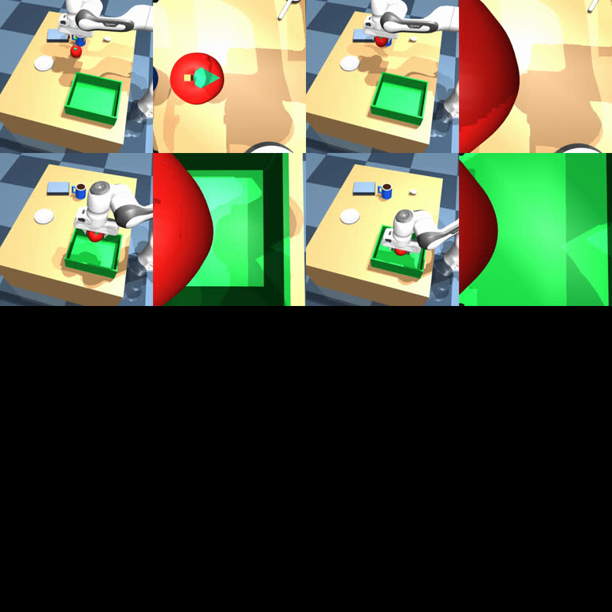

# π0.5 Panda/MuJoCo Fine-tuning Lab

<p align="center">
  
</p>

<p align="center"><em>Panda 在 MuJoCo 随机桌面场景中执行多物体抓取与绿色盒子放置任务。</em></p>

## 1. 项目概述

本项目使用规划教师在 MuJoCo 中生成 Panda 多物体抓放数据，在单卡 GPU 上对 OpenPI π0.5 进行 LoRA 微调，再用 receding-horizon 闭环控制评测 50k 和 100k checkpoint。

任务指令模板：

```text
Pick up the {target} and place it in the green box.
```

| 项目 | 设置 |
|---|---|
| 目标物体 | red apple、orange、blue can、yellow box |
| 观测 | 外部 RGB、腕部 RGB、8 维关节/夹爪 state、英文 prompt |
| 动作 | 8 维绝对关节/夹爪目标，`action_horizon=50` |
| 控制 | 每次预测动作块，执行前 10 步后重新观测 |
| 训练数据 | 400 episodes / 94,064 frames |
| 验证数据 | 60 episodes / 14,875 frames |
| 冻结测试 | 100 个未见 seed，不含 teacher action |
| 当前最佳模型 | 100k checkpoint，`smooth_alpha=1.0` |

**核心结果：**100k 模型在 40 个普通冻结场景上成功 **35/40（87.5%）**；在两个互不重叠的 40 场景子集上合计成功 **71/80（88.75%）**。

## 2. 实验报告

### 2.1 评测协议

| 参数 | 值 |
|---|---:|
| 同一次观测后执行动作数 | 10 |
| 最大规划周期 | 100 |
| 成功后继续录制周期 | 5 |
| 主对比平滑参数 | `alpha=0.2` 与 `alpha=1.0` |
| 主 checkpoint | 50k 与 100k |
| 配对方式 | 同一 seed、目标物和控制参数 |

`smooth_alpha` 使用指数移动平均：

```text
executed_target = alpha * new_prediction + (1 - alpha) * previous_target
```

`alpha=1.0` 表示不做跨动作 EMA；它不会取消每个 100 ms 控制周期内的线性插值。较小 alpha 能抑制目标抖动，但也会带来跟随滞后，可能妨碍快速重新对准。

### 2.2 总体成功率

| 场景子集 | alpha | 50k | 100k | 变化 |
|---|---:|---:|---:|---:|
| 普通冻结场景 | 0.2 | 34/40（85.0%） | 32/40（80.0%） | -5.0 pp |
| 普通冻结场景 | 1.0 | 32/40（80.0%） | **35/40（87.5%）** | **+7.5 pp** |
| recovery 标签子集 | 0.2 | 22/40（55.0%） | 28/40（70.0%） | +15.0 pp |
| recovery 标签子集 | 1.0 | 30/40（75.0%） | **36/40（90.0%）** | **+15.0 pp** |
| 两子集合计 | 1.0 | 62/80（77.5%） | **71/80（88.75%）** | **+11.25 pp** |

100k 是目前最佳 checkpoint。在 `alpha=1.0` 下，80 个同 seed 配对回合中出现 11 个“50k 失败、100k 成功”和 2 个“50k 成功、100k 失败”。双侧精确 McNemar 检验为 `p≈0.0225`，说明本次冻结测试上的总体改善不只是一两个场景造成的。

### 2.3 100k 按目标物体统计

| 子集 / alpha | apple | box | can | orange | 总计 |
|---|---:|---:|---:|---:|---:|
| 普通 / 0.2 | 8/10 | 6/10 | 10/10 | 8/10 | 32/40 |
| 普通 / 1.0 | 9/10 | 7/10 | 10/10 | 9/10 | 35/40 |
| recovery 标签 / 0.2 | 7/10 | 6/10 | 8/10 | 7/10 | 28/40 |
| recovery 标签 / 1.0 | 10/10 | 6/10 | 10/10 | 10/10 | 36/40 |
| 两子集合计 / 1.0 | **19/20** | **13/20** | **20/20** | **19/20** | **71/80** |

`can` 最稳定，在 100k、`alpha=1.0` 下达到 20/20。`box` 只有 13/20，是当前唯一明显偏弱的物体，后续数据补强应优先覆盖方块的夹取宽度、姿态偏差和失败后重抓。

### 2.4 平滑参数影响

50k 普通场景的完整平滑对比：

| alpha | apple | box | can | orange | 成功率 |
|---:|---:|---:|---:|---:|---:|
| 0.2 | 8/10 | 8/10 | 10/10 | 8/10 | **34/40（85.0%）** |
| 0.3 | 9/10 | 6/10 | 9/10 | 7/10 | 31/40（77.5%） |
| 0.5 | 6/10 | 7/10 | 9/10 | 8/10 | 30/40（75.0%） |
| 1.0 | 8/10 | 6/10 | 10/10 | 8/10 | 32/40（80.0%） |

50k 时 `alpha=0.2` 较好，但 100k 时结论发生变化：

| 100k 子集 | alpha=0.2 | alpha=1.0 | 无 EMA 改变 |
|---|---:|---:|---:|
| 普通 | 32/40（80.0%） | **35/40（87.5%）** | +7.5 pp |
| recovery 标签 | 28/40（70.0%） | **36/40（90.0%）** | +20.0 pp |
| 成功回合平均步数（普通） | 36.06 | **26.77** | -25.8% |
| 成功回合平均步数（recovery 标签） | 35.61 | **33.86** | -4.9% |

因此当前默认部署参数为 `alpha=1.0`。如果真机抖动不可接受，应只补测一个较弱平滑值（如 0.8），不再扩大无必要的参数矩阵。

### 2.5 四类 recovery 训练情况是什么

这些 recovery 不是文本名称而已，而是教师采集时主动制造“第一次失败→观察结果→重新规划”的轨迹：

| recovery_type | 代码中的扰动 | 画面上会看到什么 | 希望学到的能力 |
|---|---|---|---|
| `approach_offset` | 首次抓取中心沿 x 方向故意偏移 6 cm | 夹爪在物体旁边下探，首次对不准 | 撤离后重新定位目标并对准 |
| `weak_grasp` | 首次关闭夹爪时把归一化目标固定为 0.84，故意保持较开状态 | 夹爪看似碰到物体，但夹持力/闭合量不足；抬升后物体留在桌上或夹持不稳 | 识别“没有真正拿起”，张开夹爪、后退、变换抓取中心并再次闭合 |
| `object_slip` | 首次抬升后把物体放回桌面上的安全新位置 | 物体在搬运前已脱落，原来的动作计划失效 | 重新搜索物体新位置并重抓 |
| `place_offset` | 首次放置目标沿 y 方向故意偏移 18 cm | 物体被放在绿色盒子外 | 判断任务尚未成功，再次抓起并放入盒子 |

`weak_grasp` 是当前最难的训练情况：它不是简单的位置偏差，而是要求策略从后续视觉和关节状态中推断“夹爪已经合拢，但物体并没有被稳定抬起”，然后主动废弃旧轨迹。

### 2.6 重要评测限制

**当前的 recovery 成功率不是真正的在线扰动恢复率。**

训练数据中上述四种扰动由 `pi05_local/teacher.py` 真实注入。但现有冻结测试场景只保存 `recovery_type` 标签，`run_mujoco_policy_eval_receding.py` 在 policy rollout 中没有根据该标签触发位移、弱抓或滑落事件。因此 36/40（90%）只能解读为第二组未见随机 seed 的成功率，不能用来证明四类真实扰动下的恢复能力。

| 当前数据能支持的结论 | 当前数据不能支持的结论 |
|---|---|
| 100k 在两组未见随机场景上整体优于 50k | 真实 `weak_grasp` 扰动下成功率为 60% |
| 100k、alpha=1.0 在普通冻结场景达到 87.5% | 真实 recovery 总体恢复率为 90% |
| 方块相比其他物体更难 | 模型已学会所有四类失败后重试 |

下一版评测器需要在相同 seed 上运行 nominal 与 injected-recovery 配对实验，记录扰动时刻、恢复用时、是否重抓以及最终成功。

### 2.7 配对视频与原始结果

- [13 组 50k/100k 成败变化配对视频](./artifacts/videos/checkpoint-comparison/README.md)
- [327 个可审计评测 JSON 和 run log](./artifacts/evaluations/README.md)
- [50k 恢复训练至 step 102460 的持久日志](./artifacts/logs/panda_h50_formal_v1_resume_50k_to_102k.log)
- [完整 50k vs 100k 配对报告](./reports/h50_formal_50k_vs_100k_report.md)

## 3. 数据集与方法

| split | episodes | 构成 | frames |
|---|---:|---|---:|
| train | 400 | 300 nominal + 100 recovery，四类各 25 | 94,064 |
| validation | 60 | 40 nominal + 四类 recovery 各 5 | 14,875 |
| frozen test | 100 | 50 normal + 50 recovery-labelled，无 teacher action | 不适用 |

训练采用 OpenPI π0.5 + LoRA，使用上游 commit `215abfb217dbac7d5f1273282331b9b1866c0479`。原始 LeRobot 数据约 18 GB，不存入 Git；仓库保留任务配置、数据审计、冻结场景、OpenPI 补丁和可复核的评测输出。

## 4. 仓库结构

```text
configs/          任务、相机和数据集配置
pi05_local/       MuJoCo 环境、教师和数据集实现
openpi_overlay/   OpenPI Panda 输入映射与训练配置注入
scripts/          采集、校验、转换和闭环评测脚本
tests/            本地流水线检查
reports/          数据审计、阶段报告和对比结论
artifacts/        完整评测 JSON、日志、配置补丁和关键视频
data/             冻结测试场景；大规模数据被忽略
```

## 5. 环境与运行

本地仿真依赖 Python 3.11、MuJoCo、LeRobot 及同级目录中的 `mujoco_arm_lab`。

```bash
./scripts/setup_local_env.sh
```

采集并校验小数据集：

```bash
python scripts/collect_panda_apple.py \
  --split train --mode mixed --episodes 20 \
  --dataset-root data/staging/demo --headless

python scripts/validate_panda_dataset.py \
  --dataset-root data/staging/demo \
  --report-md reports/demo-validation.md
```

100k checkpoint 闭环评测：

```bash
MUJOCO_GL=egl PYOPENGL_PLATFORM=egl \
python scripts/run_mujoco_policy_eval_receding.py \
  --checkpoint /path/to/panda_h50_formal_v1/100000 \
  --config pi05_panda_h50_formal \
  --scenes data/test_scenes.json \
  --output reports/model_eval \
  --episodes 40 --max-steps 100 \
  --execute-actions 10 --smooth-alpha 1.0 \
  --post-success-cycles 5
```

## 6. 论文阅读与项目关联

| 资料 | 本项目中对应的问题 | 阅读重点 |
|---|---|---|
| [π0: A Vision-Language-Action Flow Model for General Robot Control](https://arxiv.org/abs/2410.24164) | 为什么能从视觉、语言和 state 生成连续动作 | VLM backbone、action expert、flow matching |
| [π0.5: A Vision-Language-Action Model with Open-World Generalization](https://arxiv.org/abs/2504.16054) | 微调起点、语义条件和跨任务泛化 | 异构数据协同训练、高层语义子任务 |
| [Flow Matching for Generative Modeling](https://arxiv.org/abs/2210.02747) | 动作块是怎样通过连续速度场生成的 | probability path、条件速度场、ODE 采样 |
| [Diffusion Policy](https://arxiv.org/abs/2303.04137) | 为什么机器人策略常预测 action chunk，为什么要滚动重规划 | 多峰动作、视觉条件、receding horizon |
| [DAgger](https://proceedings.mlr.press/v15/ross11a.html) | 模型夹歪后为什么不知道怎么回到正确轨迹 | 分布偏移、学习者到达状态、教师纠正标注 |

## 7. 后续学习与实验计划

| 阶段 | 学习内容 | 实作产出 | 与本项目的连接 |
|---|---|---|---|
| 1. 强化学习基础 | MDP、return、V/Q/A、TD、policy gradient | 在简单连续控制环境复现 PPO 和 SAC，记录 reward curve 与成功率 | 理解“模仿学习的动作误差”和“RL 的长期任务回报”的区别 |
| 2. Offline RL 与 DAgger | BC 分布偏移、DAgger、TD3+BC、IQL | 为 `box + weak_grasp` 采集学习者失败状态及 teacher correction，与原 400 episodes 混合训练 | 直接解决夹歪/失败后不会继续夹的问题 |
| 3. 世界模型基础 | [World Models](https://arxiv.org/abs/1803.10122)、PlaNet、DreamerV3 | 在 MuJoCo 轨迹上学习动作条件的潜状态动力学，比较 1/5/10 步预测误差 | 判断模型能否预测“弱抓后物体会留在桌上” |
| 4. Model-based RL | imagined rollout、MPC、模型偏差、TD-MPC2 | 用学习到的 dynamics 评分候选重抓动作，与直接 policy 对比 | 研究是否能在少量新数据下提高恢复能力 |
| 5. 统一闭环评测 | 因果扰动、配对 seed、恢复时间和统计显著性 | 新建 runtime perturbation injector，同时测 BC、DAgger、RL/MBRL 版本 | 将当前“recovery 标签”升级为真正的恢复能力 benchmark |

建议执行顺序是：**先修正 recovery 评测器，再做小规模 DAgger，同时学习 RL 基础，最后再引入世界模型/MBRL。** 如果没有可信的真扰动评测，后续方法再复杂也无法证明提升。

## 8. 文档入口

- [微调复现与部署指南](./π0.5微调复现与部署指南.md)
- [云端训练工作日志](./云端训练工作日志.md)
- [本地实现与验证说明](./本地实现与验证说明.md)
- [数据集校验报告](./reports/dataset_validation.md)
- [实验 artifacts 说明](./artifacts/README.md)

## 9. 模型权重与大文件

Git 仓库不保存虚拟环境、缓存、原始数据集或 Orbax checkpoint。原始数据约 18 GB，单个 checkpoint 约 8.9 GB，应使用对象存储或模型托管平台单独发布，而不是普通 Git commit。

## 10. 许可证

本项目的原创代码和文档使用 [Apache License 2.0](./LICENSE)。项目依赖的 OpenPI、MuJoCo、MuJoCo Menagerie 和 LeRobot 仍由各自的上游许可证约束，详见 [NOTICE](./NOTICE)。
